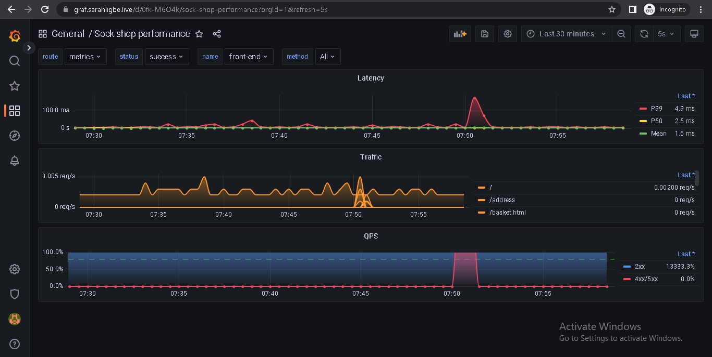
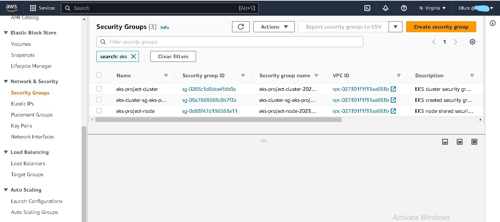

# Deploying a Kubernetes cluster with Terraform, a CI/CD pipeline with Github actions and ArgoCD, and monitoring set up.

To replicate this locally, clone the repo and do the following:
1. Set up an IAM user with Administrator privileges
2. Set your AWS credentials as environment variables
3. Make sure you already have a route53 hosted zone, add your domain name and subdomain names in the terraform.tfvars file
4. Set the following terraform environment variables:
- The slack api url for argocd to send build information
```bash
export TF_VAR_argoslack=""
```
- The slack api url for alert manager to send alerts
```bash
export TF_VAR_prometheusslack=""
```
- The ArgoCD login password to view the deployments. The password has to be bcrypt hashed
```bash
export $PASS=""
export TF_VAR_argopass=$(htpasswd -nbBC 10 "" $PASS | tr -d ':\n' | sed 's/$2y/$2a/')
```
You can also set these variables in Github Actions secrets.

## Live links
My sock-shop is hosted on [sock.sarahligbe.live](https://sock.sarahligbe.live)  
My portfolio is hosted on [portfolio.sarahligbe.live](https://portfolio.sarahligbe.live)  
ArgoCD is hosted on [argocd.sarahligbe.live](https://argocd.sarahligbe.live)  (**username = admin**)  
Grafana is hosted on [graf.sarahligbe.live](https://graf.sarahligbe.live)  (**username = admin**) 
Prometheus is hosted on [prom.sarahligbe.live](https://prom.sarahligbe.live)  

The links no longer work. I destroyed the infrastructure

## Project details
For this project, I set up:
- A VPC with public, private and intra subnets. The intra subnets were to be assigned to the Control plane, while the Worker nodes were in the private subnet.
- Karpenter for autoscaling
- Cert manager and Let's Encrypt for SSL
- Nginx ingress to route traffic from the pods to the internet
- Prometheus and Grafana for monitoring
- Loki for logging
- Github Actions for CI
- ArgoCD for continuous deployment of the applications in the kubernetes cluster.  

## Directory details
1. The Infrastructure directory contains the terraform script to set up the EKS cluster and install cert-manager, nginx ingress controller, karpenter, prometheus, grafana, and loki. Github actions does the CI and sets this directory up. 

You can delete the backend in the providers.tf file to run it locally or use your own s3 backend.

2. The K8s directory contains the applications - the sockshop microservice app and the portfolio app. It also contains the grafana dashboard for to monitor the sockshop performance. ArgoCD does the CD and sets this directory up. 
I used the ArgoCD Application set to set up the CD since I was deploying more than one application.

## Project screenshots
The ArgoCD deployment:
  

The ArgoCD slack alert:
  

The sock-shop website: 
  

The portfolio website:
  

Prometheus:
    
  

Grafana datasources:


Grafana dashboard:
  
  

Loki logs:
  


Let's Encrypt certificate (got a wildcard certificate to cover all the subdomains)  


Github actions workflow:
  


### Additional project screenshots from the AWS Console
The EKS Cluster:  
  

EKS nodes:  
  
There is an additional instance that was created by karpenter  

EKS VPC:  
  
  

EKS Security groups:  
  

Route53:  
  

Network Load Balancer:
  

Terraform apply output:  


